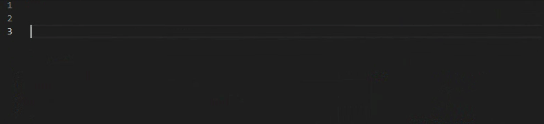

gideros-LLS-meta
-----
>**lua-language-server @meta descriptions for the Gideros SDK**

[lua-language-server](https://github.com/sumneko/lua-language-server) (LLS) compiles Lua code into an Abstract Syntax Tree (AST) and can then perform tasks like type and syntax checking. Type checking is done dynamically but, like statically typed languages, the compiler can only know so much without being told about specific types. LLS uses annotations to convey this information to the AST compiler and this repository is a collection of files containing annotations for the Gideros SDK.

Here's a demo gif of it in action, note the context sensitive auto-complete suggestions, even though both of the functions take fields from `Application`:



It allows other cool stuff too, like code formatting, symbol renaming, goto definition etc in the VSCode extension.

## Getting started
It's for use in Visual Studio Code, Neovim or other editors that support the Language Server Protocol. We'll focus on VSCode, instructions are in the LLS repo for running from the command line for other editors.
- Install the `lua-language-server` extension for Visual Studio Code (the extension is just called `Lua`). You can also use the language server from the command line in other editors if you build it from source, instructions in the the repo.
- Clone this repo to a location of your choice.
- Now in the root diretory of your Gideros project, create a file called `.luarc.json`. Copy the following contents to get started, changing `INSTALL_LOCATION` to where you cloned this repo to.
```json
{
    "Lua.workspace.library": [
        "INSTALL_LOCATION_OF_THIS_REPO"
    ],
    "Lua.diagnostics.globals": [
        "scene_manager",
        "lF4", "hF4", "tMatrix", "vMatrix", "fColor", "fTexcoord", "fTexture", "texture2D", "discard"
    ]
}
```

## Using in the wild
When creating our own classes we use the following annotation:
```lua
---@class MyClass
---@field new fun(...) : MyClass
MyClass = Core.class(Sprite)
```
... so the type system doesn't think `MyClass` is a `Sprite`.

Other than that, following the guidance on the [lua-language-server wiki](https://github.com/sumneko/lua-language-server/wiki) is the way forward!

## Contributing
This is a work in progress. If you get type errors/warnings that shouldn't happen or if you find any other gremlins or demons then please raise an issue. If you find a class/method that isn't yet annotated then please feel free to raise an issue and/or create a pull request with some changes.

The source of truth for copy/paste/Vim is:
[Gideros Wiki](https://wiki.gideros.rocks)